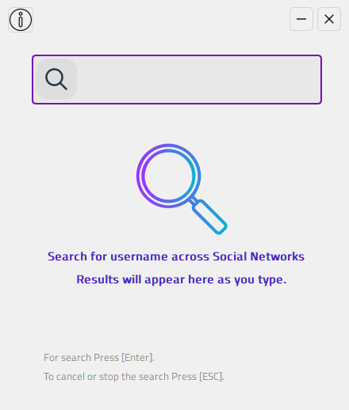
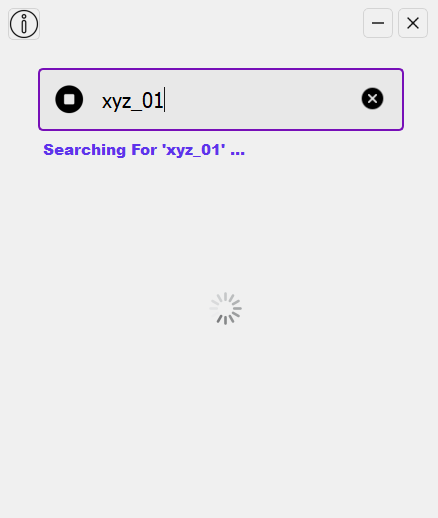

<h1 align="center">Username Searcher</h1>

 

Username Searcher is a light-weight App to search your username accross social-media networks, it is faster & easy to use and also user-friendly with good looking UI

<h2>Whats New v 1.1?</h2>

- [x] Performance Improvements
- [x] UI Inhancements
- [x] Bug Fixes!

<h2>Usage</h2>

  
  

