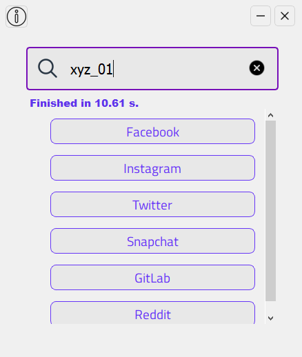

<h1 align="center">Username Searcher</h1>

 

Username Searcher is a light-weight App to search your username accross social-media networks, it is faster & easy to use and also user-friendly with good looking UI

<h2>Whats New v 1.1?</h2>

- [x] Performance Improvements
- [x] UI Inhancements
- [x] Bug Fixes!

<h2>Preview</h2>

This is a preview showing the App in action!

  
  
  

<h1 align="center">License</h1>

~~~
Copyright (c) 2023 Aymen Brahim Djelloul

Permission is hereby granted, free of charge, to any person obtaining
a copy of this software and associated documentation files
(Username Searcher), to deal in the Software without restriction, including
without limitation the rights to use, copy, modify, merge, publish,
distribute, sublicense, and/or sell copies of the Software.
~~~
